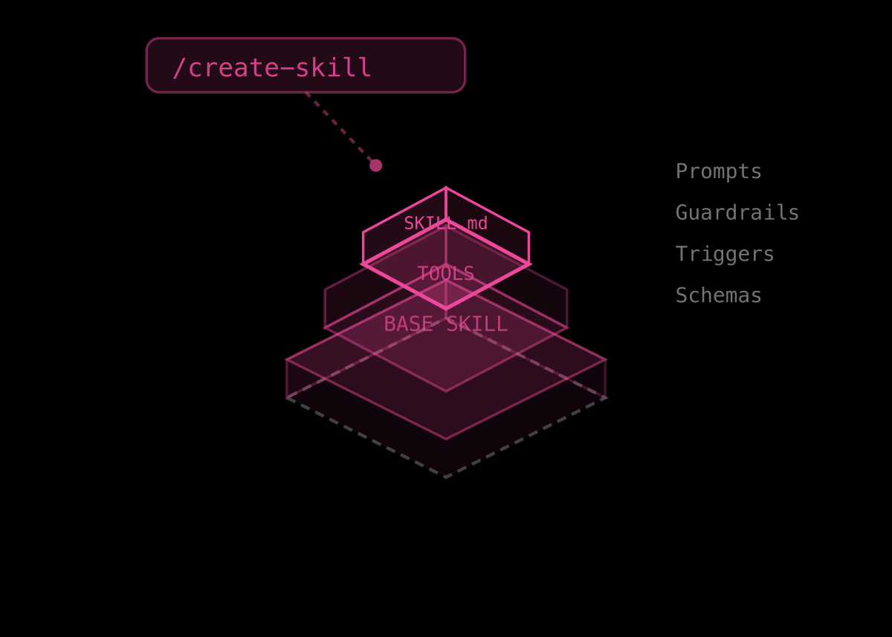

<div align="center">
  
  <br /><br />

  <h1>CloudSkills</h1>

  <p>
    The open-source community registry of AI skills for cloud engineering.<br />
    Browse, install, and contribute skills that run on <a href="https://cloudthinker.io">CloudThinker</a>.
  </p>

  <a href="https://cloudthinker.io/skills">
    
  </a>
  &nbsp;
  
  &nbsp;
  
  &nbsp;
  

  <br /><br />

  

  <br /><br />

</div>

---

## What is CloudSkills?

CloudSkills is the open-source registry powering the [Skills Hub](https://cloudthinker.io/skills) on CloudThinker. Each skill is a `SKILL.md` file — a structured instruction set that tells AI agents how to execute a specific cloud engineering task.

Skills are composable, guardrailed, and ready to deploy. They encode tribal knowledge — runbooks, SOPs, and expert workflows — into reusable AI instructions that run autonomously with human approval gates where needed.

---

## Cloud Connection Skills

Skills that operate on your connected cloud infrastructure and services.

### ☁️ Cloud Providers

| Skill | Description |
|:------|:------------|
| [aws](skills/connections/aws/SKILL.md) | AWS CLI with mandatory parallel execution patterns (30× speedup) |
| [aws-billing](skills/connections/aws-billing/SKILL.md) | Analyze and break down AWS costs, billing trends, and anomaly detection |
| [aws-idle-resources](skills/connections/aws-idle-resources/SKILL.md) | Detect unused EBS volumes, idle load balancers, stopped EC2 instances, and more |
| [aws-pricing](skills/connections/aws-pricing/SKILL.md) | Query AWS on-demand pricing for cost estimates |
| [aws-rightsizing](skills/connections/aws-rightsizing/SKILL.md) | Analyze EC2, RDS, EBS, and Lambda utilization for rightsizing opportunities |
| [azure](skills/connections/azure/SKILL.md) | Azure CLI with parallel execution patterns and resource management |
| [gcp](skills/connections/gcp/SKILL.md) | GCP CLI with cost anti-hallucination rules and parallel execution |
| [gcp-idle-resources](skills/connections/gcp-idle-resources/SKILL.md) | Detect unused GCP resources incurring cost without providing value |
| [gcp-rightsizing](skills/connections/gcp-rightsizing/SKILL.md) | Analyze Compute Engine, Cloud SQL, and Persistent Disk for rightsizing |
| [k8s](skills/connections/k8s/SKILL.md) | Kubernetes with mandatory parallel patterns, kubectl, and Helm |

### 💻 Code & DevOps

| Skill | Description |
|:------|:------------|
| [github](skills/connections/github/SKILL.md) | GitHub repos, pull requests, issues, Actions, and code review |
| [gitlab](skills/connections/gitlab/SKILL.md) | GitLab projects, merge requests, pipelines, and CI/CD |
| [bitbucket](skills/connections/bitbucket/SKILL.md) | Bitbucket workspace, repos, PRs, and pipelines |
| [analyzing-sonarqube](skills/connections/analyzing-sonarqube/SKILL.md) | SonarQube code quality, security hotspots, and technical debt |

### 📊 Observability & Monitoring

| Skill | Description |
|:------|:------------|
| [monitoring-grafana](skills/connections/monitoring-grafana/SKILL.md) | Grafana dashboards, panels, alerts, and datasources |
| [monitoring-dynatrace](skills/connections/monitoring-dynatrace/SKILL.md) | Dynatrace observability, problem management, and DQL queries |
| [monitoring-elasticsearch](skills/connections/monitoring-elasticsearch/SKILL.md) | Elasticsearch log analytics, cluster monitoring, and search |
| [analytics-cloudflare](skills/connections/analytics-cloudflare/SKILL.md) | Cloudflare zone traffic, firewall events, and performance analytics |
| [zabbix](skills/connections/zabbix/SKILL.md) | Zabbix hosts, templates, triggers, and alert management |

### 🗄️ Databases

| Skill | Description |
|:------|:------------|
| [analyzing-postgres](skills/connections/analyzing-postgres/SKILL.md) | PostgreSQL performance tuning, slow queries, and index analysis |
| [managing-supabase](skills/connections/managing-supabase/SKILL.md) | Supabase databases, Edge Functions, storage, and auth |

### 📋 Project & Operations

| Skill | Description |
|:------|:------------|
| [tracking-jira](skills/connections/tracking-jira/SKILL.md) | Jira issue tracking, sprint management, and workflow automation |
| [tracking-confluence](skills/connections/tracking-confluence/SKILL.md) | Confluence page management, space administration, and content |
| [managing-hubspot](skills/connections/managing-hubspot/SKILL.md) | HubSpot CRM contacts, companies, deals, and pipelines |
| [managing-notion](skills/connections/managing-notion/SKILL.md) | Notion pages, databases, blocks, and workspace management |

---

## Installing a Skill

**One-click via CloudThinker**

Visit [cloudthinker.io/skills](https://cloudthinker.io/skills), find a skill, and click **Install**. The skill is copied directly into your workspace — no GitHub dependency at runtime.

**Manually**

Copy a `SKILL.md` into your project's skills directory:

```bash
mkdir -p .claude/skills/aws
curl -o .claude/skills/aws/SKILL.md \
  https://raw.githubusercontent.com/cloudthinker-ai/CloudSkills/main/skills/connections/aws/SKILL.md
```

---

## Skill Format

Every skill is a single `SKILL.md` file with YAML frontmatter:

```markdown
---
name: my-skill
description: |
  What this skill does and when to invoke it.
connection_type: aws   # optional — required connection
---

# My Skill

Step-by-step instructions for the AI agent...
```

| Field | Required | Description |
|:------|:--------:|:------------|
| `name` | ✓ | Kebab-case identifier matching the directory name |
| `description` | ✓ | Purpose and context for when to use this skill |
| `connection_type` | — | Required cloud connection (e.g. `aws`, `k8s`, `github`) |

See [SPEC.md](SPEC.md) for the full specification.

---

## Contributing

We welcome skills that encode real-world cloud engineering expertise.

1. **Fork** this repository
2. **Create** `skills/connections/<provider>/<your-skill>/SKILL.md`
3. **Open a pull request** — CI validates your skill automatically
4. **After merge**, the skill appears on CloudThinker within 1 hour

Read [CONTRIBUTING.md](CONTRIBUTING.md) for the quality checklist and review process.

---

## License

MIT — see [LICENSE](LICENSE)

<div align="center">
  <br />
  <sub>Built with ❤️ by <a href="https://cloudthinker.io">CloudThinker</a></sub>
</div>
